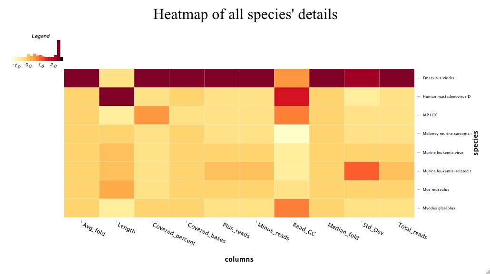

# virusunburst

The virusunburst package provides functions to easily visualise ViruSreen results. 
## Installation

```r
devtools::install_github("MichelledeGroot/virusunburst", dependencies=TRUE)
```

## Usage single sample analysis

``` r
library(virusunburst)
```

With the make_sunburst function, you can create a sunburst that will plot the taxonomies based on the total read count for each best hit.
The inner circle represents the families, the middle circle represents the genus and the outer circle represents the species.
``` r
make_sunburst("path_to_full_taxonomy.csv")
```


Alternatively, you can choose a different column as group size.
``` r
make_sunburst("path_to_full_taxonomy.csv", size_col = "Covered_bases")
```

Another function is to create a heatmap of your sample. This will illustrate the values of all columns.
``` r
make_heatmap("path_to_full_taxonomy.csv")
```


## Usage multiple sample analysis

To create a stacked bar plot of the total amount of reads per species, you can use the following function:
``` r
compare_runs("path_to_folder")
```
The path you provide has to be a folder where the full taxonomy csv files are stored. An example of such a plot is shown below:


